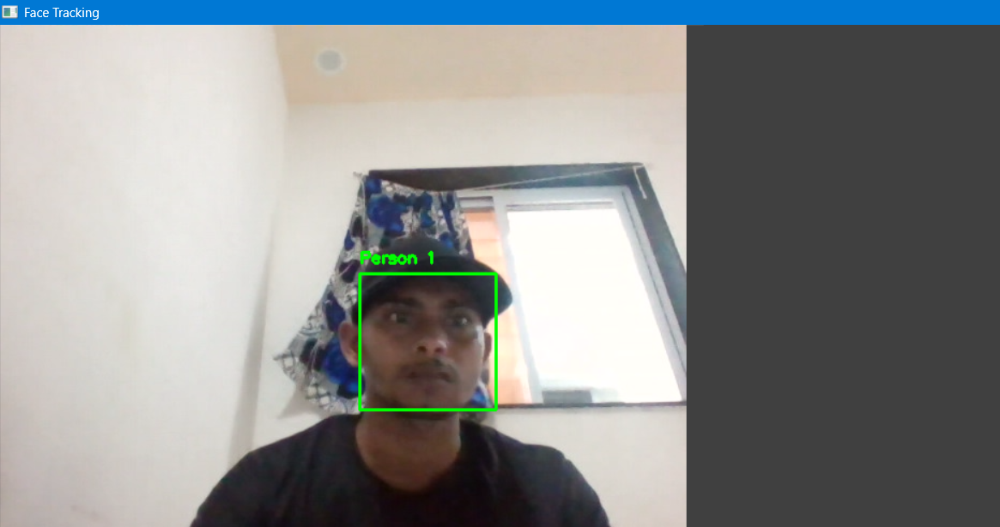

# Face-Detection-OpenCV-Python
Real-time face detection using python and OpenCV library with Haar cascade model# Real-Time Face Detection using Python & OpenCV

This project performs real-time face detection using your webcam, built with Python and OpenCV.

## 🔧 Features
- Detects faces in real-time using Haar cascade classifier
- Draws bounding boxes and names around detected faces
- Runs from webcam with simple Python script

## 🛠 Requirements
- Python 3.x
- OpenCV (`pip install opencv-python`)

## ▶️ How to Run
1. Clone or download this repository
2. Install OpenCV:
3. Run the script:

# face detection

## 📷 Demo

## 🚀 Future Ideas
- Add face recognition
- merging with emotion detection

---

## 📄 License
MIT License

